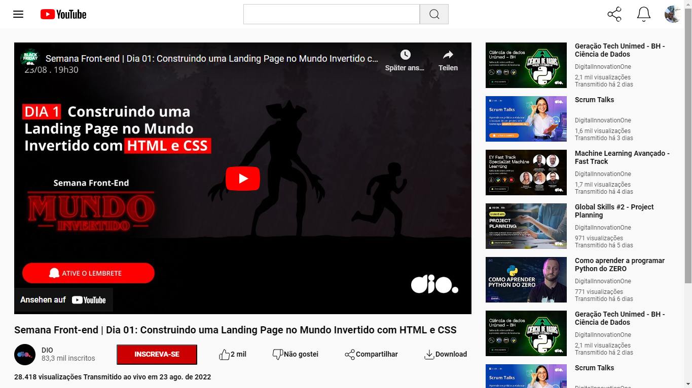

# Clonando a Página do YouTube

O desafio do projeto realizado é clonar a página do YouTube com CSS colocando em prática todos os conceitos aprendidos, principalmente sobre Flexbox..

Este desafio faz parte da [Formação CSS Web Developer](https://www.dio.me/curso-css) da DIO, onde teve como base o modelo disponibilizado no [Figma](https://www.figma.com/file/lrRWUZPKnqMDZrSDJmZxUS/Desafio-de-Flexbox---DIO?type=design&node-id=0-1&mode=design&t=kIWj3CPd6q8IEiJv-0) para o layout e dimensionamento.

### Tecnologias 💻

## Para Desktop

## Para Mobile
Em desenvolvimento...